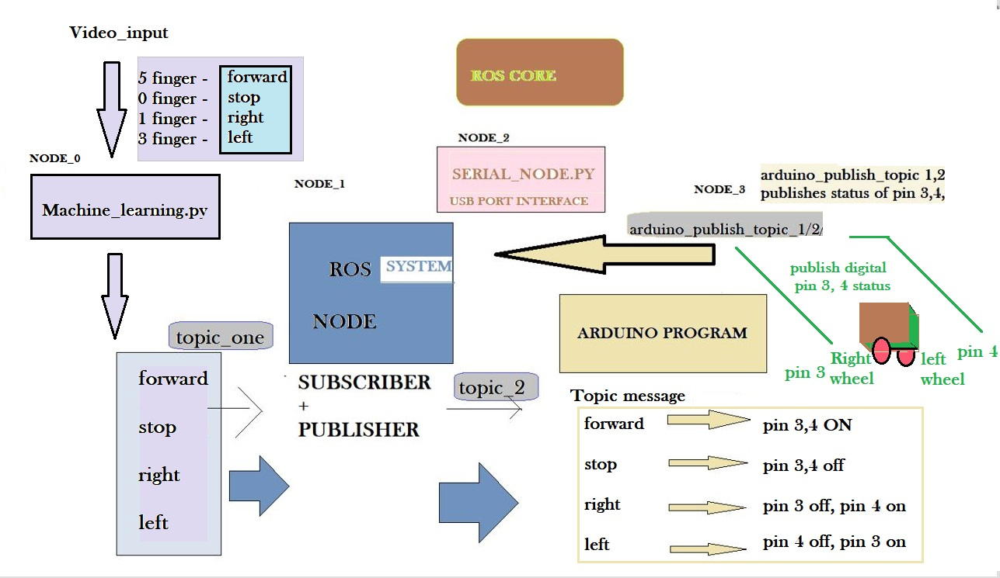

# ROBOT_CAR
CREATING A ROBOT-CAR OpenSource Project for Everyone

The project has just started ! 
#/machine_learning/ros/arduino/robot car

>#SOME MAJOR GOALS  
>Using camera to input the direction for robot Car.

***

 # SIMPLE Software_OUTLINE
   I am building this project by developing my "Arduino/ROS interfacing repos"   
   1. [Arduino_Repo](https://github.com/winnergetsyou/Course_1_Arduino.git)    
   2. [ROS_repo](https://github.com/winnergetsyou/COURSE_1_ROS_NODES.git)  
   Here, is my initial outline of my project.  
   Note: This outline use Transistor to increase the power for the motors [H - BRIDGE IS ALSO ON MY CONSIDERATION]

